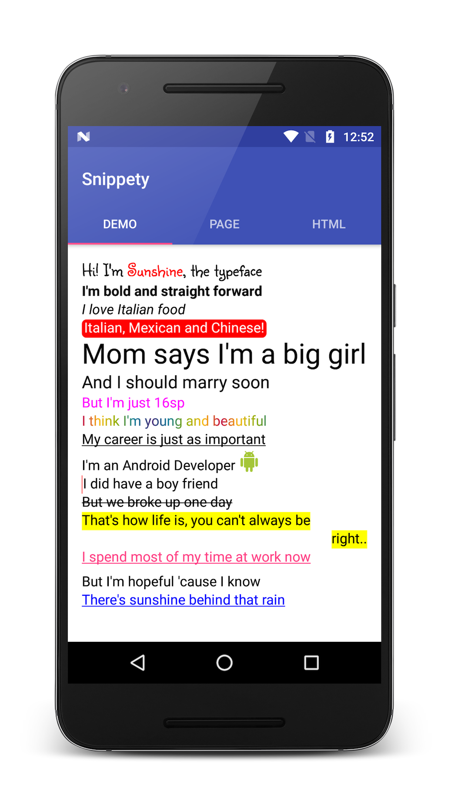
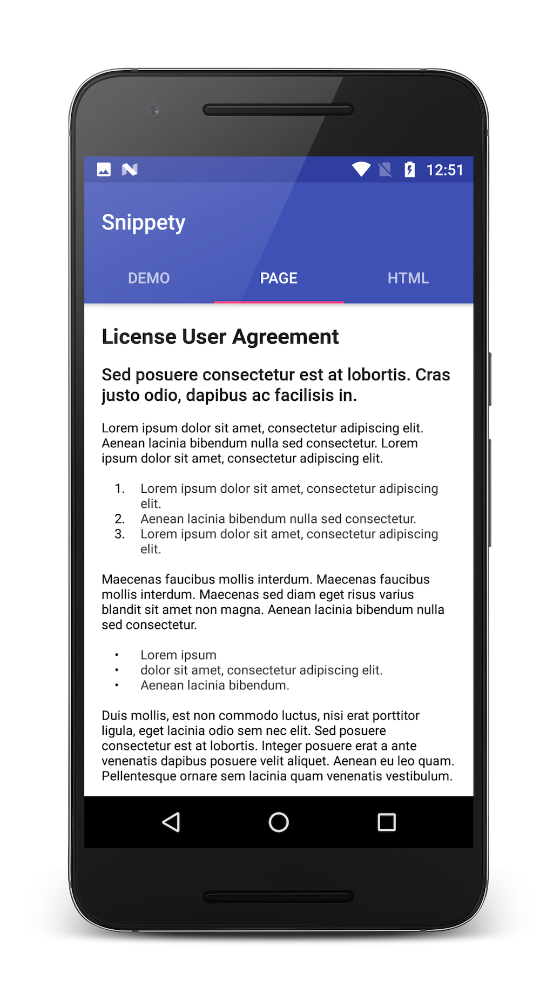

# snippety-android

A wrapper class on top of `SpannableStringBuilder` with utility methods for android and custom spans.
You can trust [Snippety](./snippety/src/main/java/com/fueled/snippety/core/Snippety.java) and [Truss](./snippety/src/main/java/com/fueled/snippety/core/Truss.java) (by Jake Warton) to write cool text snippets which might be a pain in the neck otherwise.



# Installation

Add the following to your root `build.gradle` at the end of repositories:

```groovy
allprojects {
    repositories {
        ...
        maven { url "https://jitpack.io" }
    }
}
```

Add the following dependency to your app `build.gradle`:

```groovy
dependencies {
    compile 'com.github.fueled.snippety:{latest_version}'
}
```

# How to use

## Using Truss:

`Truss` returns a `CharSequence`. There are 2 ways of using it:

1. Nested append : `pushSpan(Span)`, `append(String)` and `popSpan()`

```java
CharSequence text = new Truss()
        .pushSpan(new BackgroundColorSpan(Color.RED))
        .append("Hello Snippety")
        .popSpan()
        .build();

```

2. Inline append : `append(String, Span)`

```java
CharSequence text = new Truss()
        .append("Hello Snippety", new BackgroundColorSpan(Color.RED))
        .build();
```

## Using Snippety

`Snippety` could be thought of as a collection of different span(s) which are anything but wrappers around the actual span(s).

```java
CharSequence text = new Truss()
        .append("Hello Snippety", new Snippety().backgroundColor(Color.RED))
        .build();
```

You can also add multiple span attributes at a time.

```java
CharSequence text = new Truss()
        .append("Hello Snippety", new Snippety().backgroundColor(Color.RED).textColor(Color.WHITE))
        .build();
```

## Finally

Set the `CharSequence` returned by Truss to your `TextView`.

```java
textView.setText(new Truss()
        .append(new Snippety().backgroundColor(Color.RED).textColor(Color.WHITE))
        .build());
```

Attach `OnClickListener` to some text:

```java
textView.setMovementMethod(LinkMovementMethod.getInstance());
textView.setText(new Truss()
        .append("Click Me!", new Snippety.OnClickListener() {
                                @Override
                                public void onClick() {
                                    Toast.makeText(getContext(), "Oooh it tickles!", Toast.LENGTH_SHORT).show();
                                }
                            })
        .build());
```

# Demo

Here is how you can achieve the demo screenshot attached

```java
textView.setText(new Truss()

        .pushSpan(new Snippety().typeface(typeface).testSizeAbsolute(textSize)) // TextTypefaceSpan
        .appendSelectiveln("Hi! I'm Sunshine, the typeface", "Sunshine",
                new Snippety().textColor(Color.RED))    //  ForegroundColorSpan
        .popSpan()

        .appendln("I'm bold and straight forward",
                new Snippety().fontStyle(Snippety.FontStyle.BOLD))  //  StyleSpan

        .appendln("I love Italian food",
                new Snippety().fontStyle(Snippety.FontStyle.ITALIC))    //  StyleSpan

        .appendln("Italian, Mexican and Chinese!",
                new Snippety().roundedBackgroundColor(Color.RED, Color.WHITE))  //  RoundedBackgroundSpan

        .appendln("Mom says I'm a big girl",
                new Snippety().textSizeRelative(2f))    //  RelativeSizeSpan

        .appendln("And I should marry soon",
                new Snippety().testSizeAbsolute(textSize))  //  AbsoluteSizeSpan

        .appendln("But I'm just 16sp",
                new Snippety().textColor(Color.MAGENTA))    //  ForegroundColorSpan

        .appendln("I think I'm young and beautiful",
                new Snippety().textMultiColor(colorsRainbow))   //  MultiColorSpan

        .appendln("My career is just as important",
                new Snippety().underline()) //  UnderlineSpan

        .append("I'm an Android Developer ")

        .appendln(drawable.toString(),
                new Snippety().image(drawable)) //  ImageSpan

        .appendln("I did have a boy friend",
                new Snippety().quote(Color.RED))    //  QuoteSpan

        .appendln("But we broke up one day",
                new Snippety().strikethrough()) //  StrikethroughSpan

        .appendln("That's how life is, you can't always be",
                new Snippety().backgroundColor(Color.YELLOW))   //  BackgroundColorSpan

        .appendln("right..",
                new Snippety().align(Snippety.Indent.RIGHT).backgroundColor(Color.YELLOW))  //  AlignmentSpan

        .appendln("I spend most of my time at work now",
                new Snippety().url("http://developer.android.com")) //  URLSpan

        .appendln("But I'm hopeful 'cause I know",
                new Snippety().subscript()) //  SubscriptSpan

        .appendln("There's sunshine behind that rain",
                new Snippety().textColor(Color.BLUE).addOnClickListener(new Snippety.OnClickListener() {
                    @Override
                    public void onClick() {
                        Toast.makeText(getContext(), "Thanks for stopping by!", Toast.LENGTH_SHORT).show();
                    }
                })) //  ClickableSpan
        .build());
```

# Snippety Snippets

Here are some code snippets for `Snippety` spans (tongue twister :D)

- Typeface

```java
Typeface typeface = Typeface.createFromAsset(getContext().getAssets(), getString(R.string.font_sunshiney));
textView.setText(new Truss()
        .append("Hello Snippety", new Snippety().typeface(typeface))
        .build());
```

- Font Style

```java
textView.setText(new Truss()
        .append("Hello Snippety", new Snippety().fontStyle(Snippety.FontStyle.BOLD))
        .build());
```

- Image Drawable

```java
Drawable drawable = ContextCompat.getDrawable(getContext(), R.drawable.ic_android_green_24dp);
textView.setText(new Truss()
        .append(drawable.toString(), new Snippety().image(drawable))
        .build());
```

- Align

```java
textView.setText(new Truss()
        .append("Hello Snippety", new Snippety().align(Snippety.Indent.RIGHT))
        .build());
```

- Background Color

```java
textView.setText(new Truss()
        .append("Hello Snippety", new Snippety().backgroundColor(Color.RED))
        .build());
```

- Rounded Background Color

```java
textView.setText(new Truss()
        .append("Hello Snippety", new Snippety().roundedBackgroundColor(Color.RED, Color.WHITE))
        .build());
```

- Text Color

```java
textView.setText(new Truss()
        .append("Hello Snippety", new Snippety().textColor(Color.BLUE))
        .build());
```

- Text Multi Color

```java
int[] colorsRainbow = getResources().getIntArray(R.array.rainbow);
textView.setText(new Truss()
        .append("Hello Snippety", new Snippety().textMultiColor(colorsRainbow))
        .build());
```

- Ordered List

```java
int leadGap = getResources().getDimensionPixelOffset(R.dimen.space_medium);
int gapWidth = getResources().getDimensionPixelOffset(R.dimen.space_xlarge);
textView.setText(new Truss()
        .appendln("Number One", new Snippety().number(leadGap, gapWidth, 1))
        .appendln("Number Two", new Snippety().number(leadGap, gapWidth, 2))
        .appendln("Number Three", new Snippety().number(leadGap, gapWidth, 3))
        .build());
```

# Reference

- [JakeWharton/Truss.java](https://gist.github.com/JakeWharton/11274467)

# License

```
Copyright 2017 Fueled

Licensed under the Apache License, Version 2.0 (the "License");
you may not use this file except in compliance with the License.
You may obtain a copy of the License at

   http://www.apache.org/licenses/LICENSE-2.0

Unless required by applicable law or agreed to in writing, software
distributed under the License is distributed on an "AS IS" BASIS,
WITHOUT WARRANTIES OR CONDITIONS OF ANY KIND, either express or implied.
See the License for the specific language governing permissions and
limitations under the License.
```