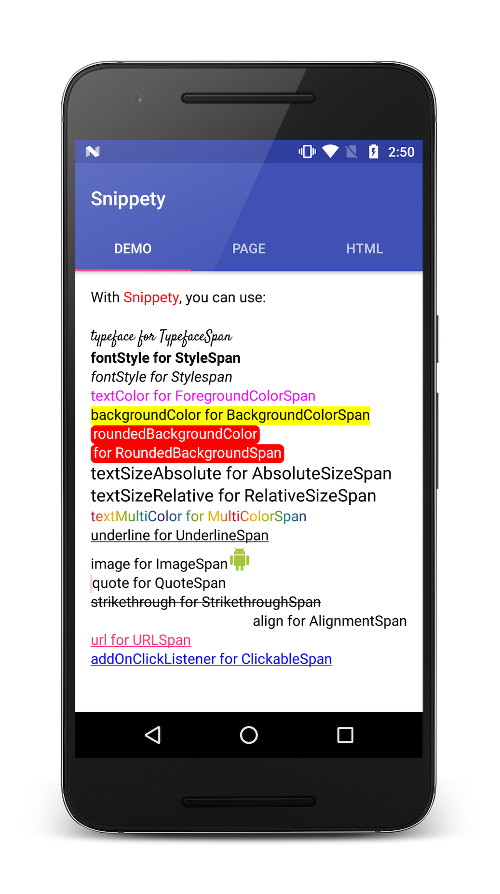
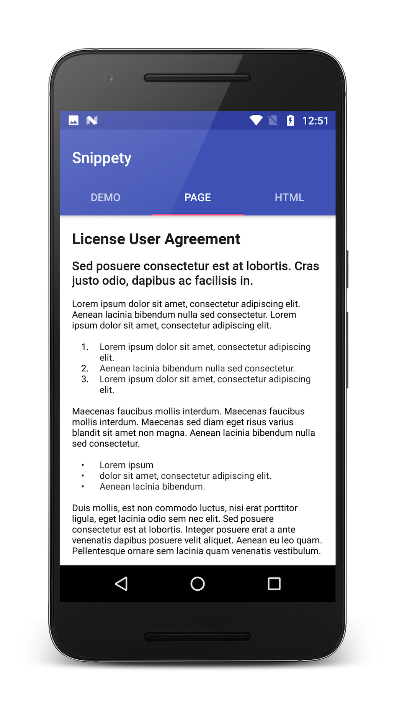

# snippety-android [](https://jitpack.io/#Fueled/snippety)

A wrapper class on top of `SpannableStringBuilder` with utility methods for android and custom spans.
You can trust [Snippety](./snippety/src/main/java/com/fueled/snippety/core/Snippety.java) and [Truss](./snippety/src/main/java/com/fueled/snippety/core/Truss.java) (by Jake Warton) to write cool text snippets which might be a pain in the neck otherwise.



# Installation

Add the following to your root `build.gradle` at the end of repositories:

```groovy
allprojects {
    repositories {
        ...
        maven { url "https://jitpack.io" }
    }
}
```

Add the following dependency to your app `build.gradle`:

```groovy
dependencies {
    compile 'com.github.fueled:snippety:{latest_version}'
}
```

# How to use

## Using Truss:

`Truss` returns a `CharSequence`. There are 2 ways of using it:

1. Nested append : `pushSpan(Span)`, `append(String)` and `popSpan()`

```java
CharSequence text = new Truss()
        .pushSpan(new BackgroundColorSpan(Color.RED))
        .append("Hello Snippety")
        .popSpan()
        .build();

```

2. Inline append : `append(String, Span)`

```java
CharSequence text = new Truss()
        .append("Hello Snippety", new BackgroundColorSpan(Color.RED))
        .build();
```

## Using Snippety

`Snippety` could be thought of as a collection of different span(s) which are anything but wrappers around the actual span(s).

```java
CharSequence text = new Truss()
        .append("Hello Snippety", new Snippety().backgroundColor(Color.RED))
        .build();
```

You can also add multiple span attributes at a time.

```java
CharSequence text = new Truss()
        .append("Hello Snippety", new Snippety().backgroundColor(Color.RED).textColor(Color.WHITE))
        .build();
```

## Finally

Set the `CharSequence` returned by Truss to your `TextView`.

```java
textView.setText(new Truss()
        .append(new Snippety().backgroundColor(Color.RED).textColor(Color.WHITE))
        .build());
```

Attach `OnClickListener` to some text:

```java
textView.setMovementMethod(LinkMovementMethod.getInstance());
textView.setText(new Truss()
        .append("Click Me!", new Snippety.OnClickListener() {
                                @Override
                                public void onClick() {
                                    Toast.makeText(getContext(), "Oooh it tickles!", Toast.LENGTH_SHORT).show();
                                }
                            })
        .build());
```

# Demo

Here is how you can achieve the demo screenshot attached

```java
textView.setText(new Truss()

        .appendSelectiveln("With Snippety, you can use:", "Snippety",
             new Snippety().textColor(Color.RED))
        .appendln()

        .pushSpan(new Snippety().typeface(typeface)) // TextTypefaceSpan
        .appendln("typeface for TypefaceSpan")
        .popSpan()

        .appendln("fontStyle for StyleSpan",
             new Snippety().fontStyle(Snippety.FontStyle.BOLD))  //  StyleSpan

        .appendln("fontStyle for Stylespan",
             new Snippety().fontStyle(Snippety.FontStyle.ITALIC))    //  StyleSpan

        .appendln("textColor for ForegroundColorSpan",
             new Snippety().textColor(Color.MAGENTA))    //  ForegroundColorSpan

        .appendln("backgroundColor for BackgroundColorSpan",
             new Snippety().backgroundColor(Color.YELLOW))   //  BackgroundColorSpan

        .appendln("roundedBackgroundColor\nfor RoundedBackgroundSpan",
             new Snippety().roundedBackgroundColor(Color.RED, Color.WHITE))  //  RoundedBackgroundSpan

        .appendln("textSizeAbsolute for AbsoluteSizeSpan",
             new Snippety().textSizeAbsolute(textSize))  //  AbsoluteSizeSpan

        .appendln("textSizeRelative for RelativeSizeSpan",
             new Snippety().textSizeRelative(1.2f))    //  RelativeSizeSpan

        .appendln("textMultiColor for MultiColorSpan",
             new Snippety().textMultiColor(colorsRainbow))   //  MultiColorSpan

        .appendln("underline for UnderlineSpan",
             new Snippety().underline()) //  UnderlineSpan

        .append("image for ImageSpan")

        .appendln(drawable.toString(),
             new Snippety().image(drawable)) //  ImageSpan

        .appendln("quote for QuoteSpan",
             new Snippety().quote(Color.RED))    //  QuoteSpan

        .appendln("strikethrough for StrikethroughSpan",
             new Snippety().strikethrough()) //  StrikethroughSpan

        .appendln("align for AlignmentSpan",
             new Snippety().align(Snippety.Indent.RIGHT))  //  AlignmentSpan

        .appendln("url for URLSpan",
             new Snippety().url("http://developer.android.com")) //  URLSpan

        .appendln("addOnClickListener for ClickableSpan",
             new Snippety().textColor(Color.BLUE).addOnClickListener(new Snippety.OnClickListener() {
                 @Override
                 public void onClick() {
                     Toast.makeText(getContext(), "Thanks for stopping by!", Toast.LENGTH_SHORT).show();
                 }
             })) //  ClickableSpan
        .build();
```

# Snippety Snippets

Here are some code snippets for `Snippety` spans (tongue twister :D)

- Typeface

```java
Typeface typeface = Typeface.createFromAsset(getContext().getAssets(), getString(R.string.font_sunshiney));
textView.setText(new Truss()
        .append("Hello Snippety", new Snippety().typeface(typeface))
        .build());
```

- Font Style

```java
textView.setText(new Truss()
        .append("Hello Snippety", new Snippety().fontStyle(Snippety.FontStyle.BOLD))
        .build());
```

- Image Drawable

```java
Drawable drawable = ContextCompat.getDrawable(getContext(), R.drawable.ic_android_green_24dp);
textView.setText(new Truss()
        .append(drawable.toString(), new Snippety().image(drawable))
        .build());
```

- Align

```java
textView.setText(new Truss()
        .append("Hello Snippety", new Snippety().align(Snippety.Indent.RIGHT))
        .build());
```

- Absolute Text Size

```java
int textSize = getResources().getDimensionPixelOffset(R.dimen.text_large);
textView.setText(new Truss()
        .append("Hello Snippety", new Snippety().textSizeAbsolute(textSize))
        .build());
```

- Relative Text Size

```java
textView.setText(new Truss()
        .append("Hello Snippety", new Snippety().textSizeRelative(1.2f))
        .build());
```

- Background Color

```java
textView.setText(new Truss()
        .append("Hello Snippety", new Snippety().backgroundColor(Color.RED))
        .build());
```

- Rounded Background Color

```java
textView.setText(new Truss()
        .append("Hello Snippety", new Snippety().roundedBackgroundColor(Color.RED, Color.WHITE))
        .build());
```

- Text Color

```java
textView.setText(new Truss()
        .append("Hello Snippety", new Snippety().textColor(Color.BLUE))
        .build());
```

- Text Multi Color

```java
int[] colorsRainbow = getResources().getIntArray(R.array.rainbow);
textView.setText(new Truss()
        .append("Hello Snippety", new Snippety().textMultiColor(colorsRainbow))
        .build());
```

- Ordered List

```java
int leadGap = getResources().getDimensionPixelOffset(R.dimen.space_medium);
int gapWidth = getResources().getDimensionPixelOffset(R.dimen.space_xlarge);
textView.setText(new Truss()
        .appendln("Number One", new Snippety().number(leadGap, gapWidth, 1))
        .appendln("Number Two", new Snippety().number(leadGap, gapWidth, 2))
        .appendln("Number Three", new Snippety().number(leadGap, gapWidth, 3))
        .build());
```

# Reference

- [JakeWharton/Truss.java](https://gist.github.com/JakeWharton/11274467)

# License

```
Copyright 2017 Fueled

Licensed under the Apache License, Version 2.0 (the "License");
you may not use this file except in compliance with the License.
You may obtain a copy of the License at

   http://www.apache.org/licenses/LICENSE-2.0

Unless required by applicable law or agreed to in writing, software
distributed under the License is distributed on an "AS IS" BASIS,
WITHOUT WARRANTIES OR CONDITIONS OF ANY KIND, either express or implied.
See the License for the specific language governing permissions and
limitations under the License.
```